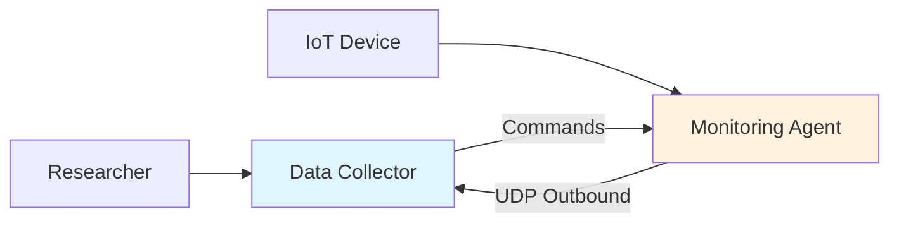

# FIRMUS

<div align="center">

**Firewall-traversing Independent Remote Monitoring and Uninterrupted Filesystem Access System**

[](https://opensource.org/licenses/MIT)
[](https://www.python.org/downloads/)

Remote filesystem monitoring for IoT and edge devices behind NAT/firewalls

[📖 Documentation](#-documentation) • [🚀 Quick Start](#-quick-start) • [🛡️ Security](#-security-notice)

</div>

---

## ⚠️ Security Notice

**Research prototype — NOT production-ready**

| Status | Implementation |
|--------|---------------|
| 🔒 Encryption | ❌ Cleartext UDP |
| 🔐 Authentication | ❌ None |
| 🧿 Authorization | ❌ No access control |

**DO NOT deploy without additional security.** See [SECURITY.md](SECURITY.md)

---

## ⚡ Quick Start

```bash
# Terminal 1 - Collector (your machine)
python3 remote_filesystem_research.py collector udp --port 5353

# Terminal 2 - Agent (target device)
python3 remote_filesystem_research.py agent udp --collector YOUR_IP:5353 --dir /path/to/monitor
```

---

## 🏗️ Architecture



**Key Insight:** Agents initiate **outbound** connections → traverses NAT/firewall automatically

---

## 📋 Features

| Feature | Status | Description |
|---------|--------|-------------|
| 🔓 Firewall Traversal | ✅ | Agent connects out through NAT |
| 👤 No Root Required | ✅ | Runs in user space |
| 📁 Directory Listing | ✅ | Flat + recursive tree |
| 📥 File Download | ✅ | Chunked transfer with resume |
| 💓 Connectivity Check | ✅ | Ping/pong heartbeat |
| 🪶 Lightweight | ✅ | ~600 lines, stdlib only |
| 🐍 Cross-Platform | ✅ | Linux, macOS, Windows |

---

## 🚀 Use Cases

| Use Case | Description | Link |
|----------|-------------|------|
| 🏠 **IoT Monitoring** | Smart home sensors on Raspberry Pi | [examples/iot-monitoring.md](examples/iot-monitoring.md) |
| 🔬 **Research Data** | Field station data collection | [examples/data-collection.md](examples/data-collection.md) |
| 🖥️ **Home Server** | Remote admin without port forwarding | [examples/basic-usage.md](examples/basic-usage.md) |

---

## 💻 Interactive Commands

```bash
# At collector prompt
collector (192.168.1.50)> ping              # Test connectivity
collector (192.168.1.50)> list /data         # List directory
collector (192.168.1.50)> tree /data         # Recursive tree
collector (192.168.1.50)> download /data/sensor.json
collector (192.168.1.50)> exit
```

---

## 📖 Documentation

| Document | Description |
|----------|-------------|
| [docs/architecture.md](docs/architecture.md) | Protocol design, message types, data flow |
| [docs/api.md](docs/api.md) | Class and method reference |
| [docs/deployment.md](docs/deployment.md) | Installation & configuration guide |
| [docs/use-cases.md](docs/use-cases.md) | Detailed use case examples |
| [SECURITY.md](SECURITY.md) | Security limitations & requirements |
| [DISCLAIMER.md](DISCLAIMER.md) | Legal and ethical guidelines |

---

## 🛡️ Security Notice

<div align="center">

**⚠️ This is a research prototype.**

See [SECURITY.md](SECURITY.md) for production deployment requirements

</div>

---

## 📊 Protocol Format

```
┌─────────────────────────────────────────────────────────────┐
│  HEADER (13 bytes)                                          │
│  ├─ Type: 1 byte  │ Seq: 4 bytes │ TS: 4 bytes │ Len: 4B   │
├─────────────────────────────────────────────────────────────┤
│  PAYLOAD (variable)                                         │
│  └─ JSON encoded data                                       │
└─────────────────────────────────────────────────────────────┘
```

| Message Type | Value | Direction |
|--------------|-------|-----------|
| DIRECTORY_LIST | 1 | Collector → Agent |
| DIRECTORY_TREE | 2 | Collector → Agent |
| FILE_TRANSFER_REQUEST | 3 | Collector → Agent |
| DATA_RESPONSE | 100 | Agent → Collector |
| HEARTBEAT | 5 | Collector → Agent |
| HEARTBEAT_ACK | 102 | Agent → Collector |
| ERROR_RESPONSE | 104 | Agent → Collector |

---

## 📈 Performance

| Operation | Time | Network |
|-----------|------|----------|
| Agent connection | <100ms | 100 Mbps residential |
| Directory list (100 files) | ~50ms | Single UDP packet |
| File download (1 MB) | ~200ms | 8KB chunks |
| Recursive scan (1000 files) | ~500ms | Filesystem dependent |

---

## 🔄 Limitations & Future

| Current | Planned |
|---------|---------|
| UDP only | TCP option |
| No encryption | AES-256-GCM |
| No auth | mTLS |
| Single-threaded | Multi-agent |
| No compression | zlib |

---

## 📜 License

MIT License — see [LICENSE](LICENSE)

---

<div align="center">

**⚠️ For authorized use only.** See [DISCLAIMER.md](DISCLAIMER.md)

Made with ❤️ for the research community

</div>
