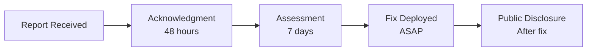

# Security Policy

<div align="center">

**⚠️ Research Prototype — NOT Production-Ready**

</div>

---

## 🚨 Current Status

| Security Layer | Status | Risk Level |
|----------------|--------|------------|
| 🔒 Encryption | ❌ None | 🔴 Critical |
| 🔐 Authentication | ❌ None | 🔴 Critical |
| 🧿 Authorization | ❌ None | 🔴 Critical |
| ✍️ Integrity | ❌ No HMAC | 🔴 Critical |
| 🚦 Rate Limiting | ❌ None | 🟡 High |

---

## Known Limitations

| Category | Issue | Mitigation |
|----------|-------|------------|
| **Transport** | Cleartext UDP | Use VPN/private network |
| **Identity** | No verification | Pre-shared keys |
| **Access** | Full filesystem | Sandboxing/containers |
| **Tampering** | No signatures | Deploy in trusted network |
| **Flooding** | No throttling | Firewall rules |
| **Replay** | Seq not validated | Short-lived sessions |

---

## 🎯 Production Requirements

| Layer | Requirement | Priority |
|-------|-------------|----------|
| **Encryption** | AES-256-GCM or TLS 1.3 | 🔴 Critical |
| **Authentication** | Mutual TLS or PSK | 🔴 Critical |
| **Authorization** | Command whitelisting | 🔴 Critical |
| **Network** | Firewall + IP whitelist | 🔴 Critical |
| **Integrity** | HMAC-SHA256 | 🟡 High |
| **Audit** | Comprehensive logging | 🟡 High |

---

## 🛡️ Deployment Security

### Network Isolation

```bash
# Firewall rules - allow only specific IPs
sudo ufw allow from 10.0.0.0/8 to any port 5353 proto udp

# VPN-required deployment
# Use WireGuard, OpenVPN, or private network
```

### Filesystem Sandboxing

```bash
# Dedicated user
useradd -r -s /bin/false firmus-agent

# Restrict directory access
chmod -R 750 /var/monitored/data

# Containerize (Docker/podman)
# Use chroot for additional isolation
```

### Monitoring

```bash
# Log all connections
# Monitor unusual access patterns
# Alert on file access outside expected hours
```

---

## 🎯 Threat Model

### Protected Threats (with mitigation)

| Threat | Mitigation |
|--------|------------|
| **Accidental exposure** | Network isolation |
| **Casual scanning** | Firewall rules |
| **Basic probing** | VPN deployment |

### Unprotected Threats

| Threat | Why Not Protected |
|--------|-------------------|
| **Network eavesdropping** | No encryption |
| **Command injection** | No authentication |
| **Unauthorized access** | No authorization |
| **Data tampering** | No integrity checks |
| **Replay attacks** | Seq not validated |

### Out of Scope

- Compromised collector
- Compromised agent host
| **Determined attackers** | Need full security stack |
| Compliance requirements | SOC2, HIPAA, etc. |

---

## 📧 Responsible Disclosure

### Reporting Vulnerabilities

<div align="center">

**DO NOT** create public issues

**DO** report privately:

</div>

| Method | Contact |
|--------|---------|
| Email | security@example.com |
| PGP Key | [Link to key] |

### Include in Report

- Vulnerability description
- Steps to reproduce
| Potential impact |
| Suggested fix (if known) |

### Response Timeline



| Stage | Timeline |
|-------|----------|
| **Acknowledgment** | Within 48 hours |
| **Assessment** | Within 7 days |
| **Fix** | As soon as practicable |
| **Public Disclosure** | After fix deployed |

---

## 🎓 Use Context

### Intended For

| Use Case | Environment |
|----------|-------------|
| 🎓 Academic research | Isolated lab networks |
| 🔧 System administration | Authorized environments |
| 🏠 IoT monitoring | Trusted home networks |
| 📚 Education | Classroom/isolated setups |

### NOT Intended For

| Misuse | ❌ |
|--------|-----|
| Unauthorized access | Bypassing security controls |
| Non-consented monitoring | Systems without owner permission |
| Evasion | Avoiding detection |

---

## 📋 Security Checklist

Before deploying, ensure:

- [ ] Deployed on isolated/trusted network
- [ ] Firewall rules configured
- [ ] Filesystem permissions restricted
- [ ] Dedicated user account created
- [ ] Logging and monitoring enabled
- [ ] Legal authorization obtained
- [ ] Container/chroot isolation considered

---

## ⚖️ Legal Disclaimer

<div align="center">

**Users are responsible for:**

- Obtaining proper authorization before deployment
- Ensuring compliance with applicable laws
- Implementing appropriate security measures

**The authors accept no liability for misuse.**

See [DISCLAIMER.md](DISCLAIMER.md) for details.

</div>

---

<div align="center">

**🔒 Always secure before production deployment**

</div>
