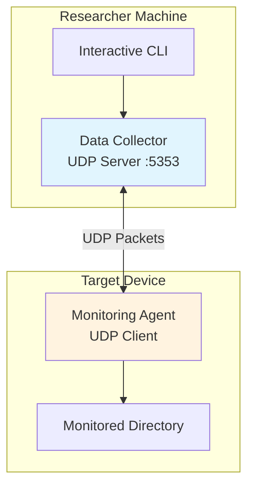
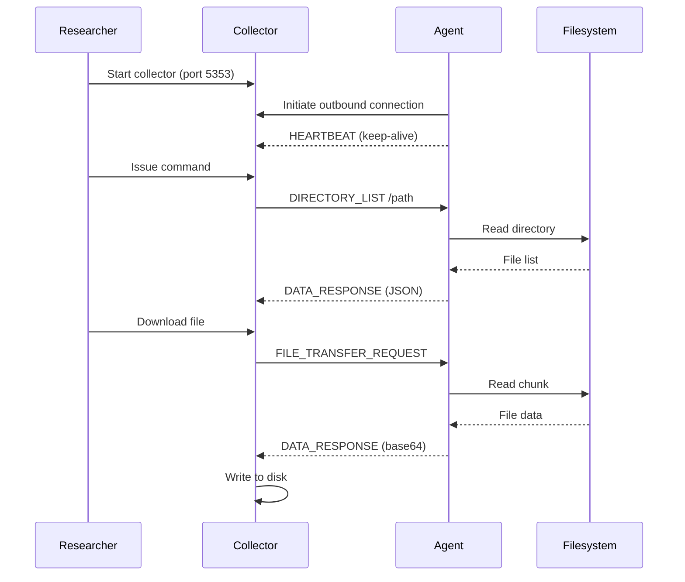
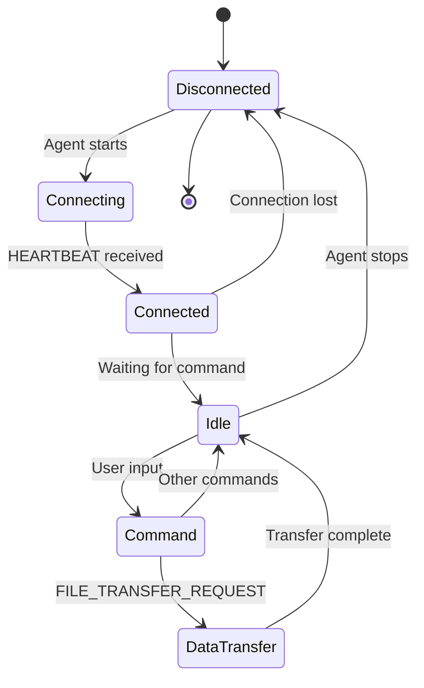

# Architecture

---

## System Overview



**Architecture Pattern:** Client-initiated outbound connection for NAT traversal

---

## Protocol Flow



---

## Packet Format

```
┌─────────────────────────────────────────────────────────────────┐
│  HEADER (13 bytes)                                              │
│  ┌─────────┬────────────────┬────────────────┬───────────────┐  │
│  │ Type    │ Sequence       │ Timestamp      │ Payload Len   │  │
│  │ 1 byte  │ 4 bytes        │ 4 bytes        │ 4 bytes       │  │
│  └─────────┴────────────────┴────────────────┴───────────────┘  │
├─────────────────────────────────────────────────────────────────┤
│  PAYLOAD (variable)                                             │
│  ┌─────────────────────────────────────────────────────────────┐ │
│  │ JSON-encoded data or base64 file chunk                      │ │
│  └─────────────────────────────────────────────────────────────┘ │
└─────────────────────────────────────────────────────────────────┘
```

### Header Structure

| Field | Bytes | Type | Description |
|-------|-------|------|-------------|
| Message Type | 1 | uint8 | Protocol message type |
| Sequence | 4 | uint32 | Message sequence number |
| Timestamp | 4 | uint32 | Unix timestamp |
| Payload Length | 4 | uint32 | Payload size in bytes |

---

## Message Types

| Type | Value | Direction | Description |
|------|-------|-----------|-------------|
| DIRECTORY_LIST | 1 | C→A | List directory (flat) |
| DIRECTORY_TREE | 2 | C→A | List directory (recursive) |
| FILE_TRANSFER_REQUEST | 3 | C→A | Request file chunk |
| DATA_RESPONSE | 100 | A→C | Return requested data |
| HEARTBEAT | 5 | C→A | Connectivity check |
| HEARTBEAT_ACK | 102 | A→C | Connectivity acknowledgment |
| ERROR_RESPONSE | 104 | A→C | Error information |

### Message Payloads

**DIRECTORY_LIST / DIRECTORY_TREE**
```json
{
  "path": "/var/sensor_data"
}
```

**DATA_RESPONSE (directory)**
```json
{
  "dirs": ["logs/", "archive/"],
  "files": [
    {"name": "sensor.json", "size": 45234},
    {"name": "config.yaml", "size": 1024}
  ]
}
```

**FILE_TRANSFER_REQUEST**
```json
{
  "file": "/var/sensor_data/logs.json",
  "offset": 0,
  "size": 8192
}
```

**DATA_RESPONSE (file chunk)**
```json
{
  "data": "base64_encoded_chunk...",
  "offset": 0,
  "size": 8192,
  "eof": false
}
```

---

## Data Flow States



---

## Connection Lifecycle

| Phase | Action | Direction |
|-------|--------|-----------|
| **Initiation** | Agent starts, resolves collector | A→C |
| **Registration** | First packet received | A→C |
| **Heartbeat** | Periodic keep-alive | A→C |
| **Command** | User issues command | C→A |
| **Response** | Data returned | A→C |
| **Termination** | Agent stops or timeout | - |

---

## File Transfer Mechanism

```mermaid
graph LR
    A[Collector] -->|Request Chunk 0| B[Agent]
    B -->|Return 8KB base64| A
    A -->|Request Chunk 1| B
    B -->|Return 8KB base64| A
    A -->|Request Chunk N| B
    B -->|Return < 8KB| A
    A -->[EOF] A

    style A fill:#e1f5fe
    style B fill:#fff3e0
```

**Chunk Size:** 8192 bytes (configurable)
**Encoding:** Base64 (network-safe)

---

## Network Topology

```
┌─────────────────────────────────────────────────────────────┐
│                      Internet / Cloud                        │
│  ┌────────────────────────────────────────────────────┐    │
│  │  VPS / Cloud Server                               │    │
│  │  ┌────────────────────────────────────────────┐   │    │
│  │  │  Data Collector (UDP :5353)                │   │    │
│  │  │  - Public IP: 203.0.113.10                 │   │    │
│  │  │  - Firewall: Allow UDP 5353                │   │    │
│  │  └────────────────────────────────────────────┘   │    │
│  └────────────────────────────────────────────────────┘    │
└─────────────────────────────────────────────────────────────┘
                          ▲
                          │ Outbound UDP (traverses NAT)
                          │
┌─────────────────────────────────────────────────────────────┐
│                Home Network / NAT / Firewall                 │
│  ┌────────────────────────────────────────────────────┐    │
│  │  IoT Device (Raspberry Pi)                        │    │
│  │  ┌────────────────────────────────────────────┐   │    │
│  │  │  Monitoring Agent (Client)                 │   │    │
│  │  │  - Private IP: 192.168.1.50                │   │    │
│  │  │  - Ephemeral port: 54321                   │   │    │
│  │  │  - Monitors: /var/sensor_data              │   │    │
│  │  └────────────────────────────────────────────┘   │    │
│  └────────────────────────────────────────────────────┘    │
└─────────────────────────────────────────────────────────────┘
```

---

## Performance Considerations

| Factor | Impact | Mitigation |
|--------|--------|------------|
| **UDP loss** | Missed packets | Application retry |
| **Packet size** | Fragmentation | Keep < MTU |
| **Chunk size** | Memory/round-trips | 8KB default |
| **Filesystem** | Scan latency | Cached listings |

---

## Error Handling

| Error Type | Response | Action |
|------------|----------|--------|
| Invalid path | ERROR_RESPONSE | Display message |
| Permission denied | ERROR_RESPONSE | Show access error |
| Not found | ERROR_RESPONSE | File not found |
| Timeout | No response | Retry or abort |

---

<div align="center">

**[← Back to README](../README.md)**

</div>
