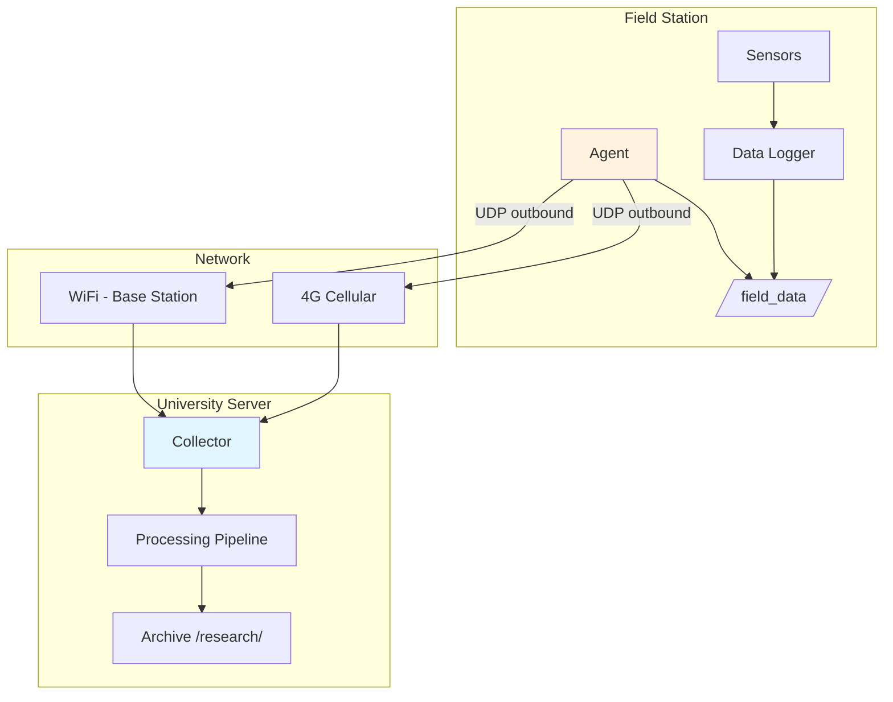

# Research Data Collection Example

---

## Scenario: Field Station Data Collection

Academic research station with environmental sensors, collecting data for analysis.

```
┌─────────────────────────────────────────────────────────────┐
│  FIELD STATION (remote location, intermittent connectivity)  │
│  ┌────────────────────────────────────────────────────┐    │
│  │  Edge Device (NVIDIA Jetson Nano / Industrial PC)   │    │
│  │  IP: 10.0.1.50 (local network)                     │    │
│  │                                                     │    │
│  │  Instrumentation:                                   │    │
│  │  • Weather station (Temp, Humidity, Pressure)      │    │
│  │  • Air quality monitor (PM2.5, PM10, CO2)          │    │
│  │  • Soil sensors (Moisture, pH, Temperature)        │    │
│  │  • Camera trap (Wildlife monitoring)               │    │
│  │                                                     │    │
│  │  Data Storage: /field_data                         │    │
│  │  ├── weather/                                      │    │
│  │  ├── air_quality/                                  │    │
│  │  ├── soil/                                         │    │
│  │  ├── camera/                                       │    │
│  │  └── logs/                                         │    │
│  │                                                     │    │
│  │  ┌────────────────────────────────────────────┐   │    │
│  │  │  Monitoring Agent                          │   │    │
│  │  │  - Auto-reconnects when network available  │   │    │
│  │  │  - Buffers data locally during offline     │   │    │
│  │  └────────────────────────────────────────────┘   │    │
│  └────────────────────────────────────────────────────┘    │
└─────────────────────────────────────────────────────────────┘
       │                    │
       │ 4G/5G Cellular     │ WiFi (when near base station)
       │ (primary)          │ (backup)
       ▼                    ▼
┌─────────────────────────────────────────────────────────────┐
│  UNIVERSITY RESEARCH SERVER                                   │
│  ┌────────────────────────────────────────────────────┐    │
│  │  Data Collector + Processing Pipeline              │    │
│  │  IP: research-university.edu (static)              │    │
│  │                                                     │    │
│  │  Automation:                                        │    │
│  │  • Hourly data downloads                          │    │
│  │  • Data validation & cleaning                     │    │
│  │  • Archive to /research/{project}/                │    │
│  │  • Generate daily reports                         │    │
│  └────────────────────────────────────────────────────┘    │
└─────────────────────────────────────────────────────────────┘
```

---

## Hardware Specification

| Component | Field Station | University Server |
|-----------|---------------|-------------------|
| **Compute** | Jetson Nano 4GB | Dell PowerEdge R240 |
| **Storage** | 500GB NVMe SSD | 20TB RAID-10 |
| **Network** | 4G USB modem + WiFi | 1Gbps Ethernet |
| **Power** | Solar + Battery + UPS | Grid + UPS |
| **OS** | Ubuntu 22.04 ARM64 | Ubuntu 22.04 x86_64 |

---

## Architecture Overview



---

## Field Station Setup

### 1. Install Dependencies

```bash
# On Jetson Nano (Ubuntu ARM64)
sudo apt update && sudo apt upgrade -y

# Install Python and scientific stack
sudo apt install -y python3 python3-pip python3-venv
pip3 install numpy pandas scipy matplotlib

# Install sensor libraries
pip3 install adafruit-circuitpython-dht
pip3 install pyserial smbus2
```

### 2. Create Directory Structure

```bash
sudo mkdir -p /field_data/{weather,air_quality,soil,camera,logs}
sudo chown -R research:research /field_data
```

### 3. Data Logger Script

`/usr/local/bin/field_logger.py`:

```python
#!/usr/bin/env python3
import json
import csv
from datetime import datetime
import time
import os

DATA_DIR = "/field_data"

def log_weather():
    """Log weather station data."""
    reading = {
        "timestamp": datetime.now().isoformat(),
        "temperature_c": 18.5,
        "humidity_pct": 72.3,
        "pressure_hpa": 1013.25,
        "wind_speed_kmh": 12.5,
        "wind_direction": "NW",
        "rainfall_mm": 0.0
    }

    # Append to daily CSV
    date_str = datetime.now().strftime("%Y-%m-%d")
    path = f"{DATA_DIR}/weather/{date_str}.csv"

    file_exists = os.path.exists(path)
    with open(path, "a", newline="") as f:
        writer = csv.DictWriter(f, fieldnames=reading.keys())
        if not file_exists:
            writer.writeheader()
        writer.writerow(reading)

def log_air_quality():
    """Log air quality data."""
    reading = {
        "timestamp": datetime.now().isoformat(),
        "pm2_5": 15.2,
        "pm10": 28.7,
        "co2_ppm": 420,
        "voc_ppb": 120,
        "ozone_ppb": 35
    }

    date_str = datetime.now().strftime("%Y-%m-%d")
    path = f"{DATA_DIR}/air_quality/{date_str}.csv"

    file_exists = os.path.exists(path)
    with open(path, "a", newline="") as f:
        writer = csv.DictWriter(f, fieldnames=reading.keys())
        if not file_exists:
            writer.writeheader()
        writer.writerow(reading)

def generate_summary():
    """Generate daily summary JSON."""
    summary = {
        "generated_at": datetime.now().isoformat(),
        "station_id": "FIELD_STATION_01",
        "location": {"lat": 45.4215, "lon": -75.6972},
        "data_directories": {
            "weather": len(os.listdir(f"{DATA_DIR}/weather")) if os.path.exists(f"{DATA_DIR}/weather") else 0,
            "air_quality": len(os.listdir(f"{DATA_DIR}/air_quality")) if os.path.exists(f"{DATA_DIR}/air_quality") else 0,
            "soil": len(os.listdir(f"{DATA_DIR}/soil")) if os.path.exists(f"{DATA_DIR}/soil") else 0,
            "camera": len(os.listdir(f"{DATA_DIR}/camera")) if os.path.exists(f"{DATA_DIR}/camera") else 0
        }
    }

    with open(f"{DATA_DIR}/summary.json", "w") as f:
        json.dump(summary, f, indent=2)

def main():
    """Main logging loop."""
    print("[*] Field data logger started")

    while True:
        try:
            log_weather()
            log_air_quality()
            generate_summary()
            print(f"[+] Logged data at {datetime.now().strftime('%Y-%m-%d %H:%M:%S')}")
        except Exception as e:
            print(f"[-] Error: {e}")

        time.sleep(300)  # Every 5 minutes

if __name__ == "__main__":
    main()
```

```bash
chmod +x /usr/local/bin/field_logger.py
```

---

## University Server Setup

### 1. Install FIRMUS

```bash
# On university server
cd /opt
sudo git clone https://github.com/yourusername/firmus.git
sudo chown -R research:research firmus
cd firmus
```

### 2. Create Processing Script

`/opt/firmus/scripts/process_data.py`:

```python
#!/usr/bin/env python3
"""
Data processing pipeline for field station data.
"""
import json
import os
from datetime import datetime

ARCHIVE_DIR = "/research/field_station_01"
RECEIVED_DIR = "/opt/firmus/received"

def process_summary():
    """Process the summary.json from field station."""
    summary_path = f"{RECEIVED_DIR}/summary.json"
    if not os.path.exists(summary_path):
        print("[-] No summary found")
        return

    with open(summary_path) as f:
        summary = json.load(f)

    date = datetime.now().strftime("%Y-%m-%d")
    daily_dir = f"{ARCHIVE_DIR}/{date}"
    os.makedirs(daily_dir, exist_ok=True)

    # Archive summary
    os.rename(summary_path, f"{daily_dir}/summary.json")
    print(f"[+] Archived summary for {date}")

    # Report
    print(f"    Weather files: {summary['data_directories']['weather']}")
    print(f"    Air quality files: {summary['data_directories']['air_quality']}")

def main():
    print("[*] Running data processing pipeline...")
    process_summary()
    print("[+] Pipeline complete")

if __name__ == "__main__":
    main()
```

---

## Automation

### Field Station (Agent)

Systemd service: `/etc/systemd/system/field-agent.service`

```ini
[Unit]
Description=FIRMUS Field Station Agent
After=network-online.target
Wants=network-online.target

[Service]
Type=simple
User=research
WorkingDirectory=/opt/firmus
ExecStart=/usr/bin/python3 /opt/firmus/remote_filesystem_research.py agent udp \\
    --collector research-university.edu:5353 \\
    --dir /field_data
Restart=always
RestartSec=30

[Install]
WantedBy=multi-user.target
```

```bash
sudo systemctl enable field-agent
sudo systemctl start field-agent
```

### University Server (Collector)

Systemd service: `/etc/systemd/system/field-collector.service`

```ini
[Unit]
Description=FIRMUS Field Data Collector
After=network.target

[Service]
Type=simple
User=research
WorkingDirectory=/opt/firmus
ExecStart=/usr/bin/python3 /opt/firmus/remote_filesystem_research.py collector udp --port 5353
Restart=always

[Install]
WantedBy=multi-user.target
```

### Automated Download Script

`/opt/firmus/scripts/auto_download.sh`:

```bash
#!/bin/bash
# Automated field data download script

cd /opt/firmus

# Get agent IP from last connection
AGENT_IP=$(grep "Agent connected" /var/log/syslog | tail -1 | grep -oP '\d+\.\d+\.\d+\.\d+' | head -1)

if [ -z "$AGENT_IP" ]; then
    echo "[-] No agent connected"
    exit 1
fi

echo "[*] Connected agent: $AGENT_IP"

# Download summary
echo "[*] Downloading summary..."
./remote_filesystem_research.py collector udp --port 5353 <<EOF
download /field_data/summary.json
exit
EOF

# Process downloaded data
if [ -f "received/summary.json" ]; then
    /usr/bin/python3 /opt/firmus/scripts/process_data.py
else
    echo "[-] No summary downloaded"
fi
```

### Cron Schedule

```bash
# Hourly data download
0 * * * * /opt/firmus/scripts/auto_download.sh >> /var/log/firmus-download.log 2>&1

# Daily archive at midnight
0 0 * * * /usr/bin/python3 /opt/firmus/scripts/daily_archive.py >> /var/log/firmus-archive.log 2>&1
```

---

## Usage

### Manual Data Collection

```bash
# On university server
cd /opt/firmus

# Start collector (or use systemd)
python3 remote_filesystem_research.py collector udp --port 5353

# When field station connects
collector (10.0.1.50)> tree /field_data
  weather/
    2024-02-19.csv
    2024-02-20.csv
  air_quality/
    2024-02-19.csv
    2024-02-20.csv
  summary.json

collector (10.0.1.50)> download /field_data/summary.json
[+] File saved: received/summary.json

collector (10.0.1.50)> download /field_data/weather/2024-02-20.csv
[+] File saved: received/2024-02-20.csv
```

---

## Data Validation

### Validation Script

`/opt/firmus/scripts/validate.py`:

```python
#!/usr/bin/env python3
import pandas as pd
import json

def validate_weather_data(csv_path):
    """Validate weather data CSV."""
    df = pd.read_csv(csv_path)

    checks = {
        "rows": len(df),
        "temp_range": df["temperature_c"].between(-30, 50).all(),
        "humidity_range": df["humidity_pct"].between(0, 100).all(),
        "no_nulls": df.notna().all().all()
    }

    return checks

if __name__ == "__main__":
    # Validate latest data
    checks = validate_weather_data("received/2024-02-20.csv")
    print(json.dumps(checks, indent=2))
```

---

<div align="center">

**[← Back to Documentation](../docs/)** • **[Basic Usage](basic-usage.md)**

</div>
